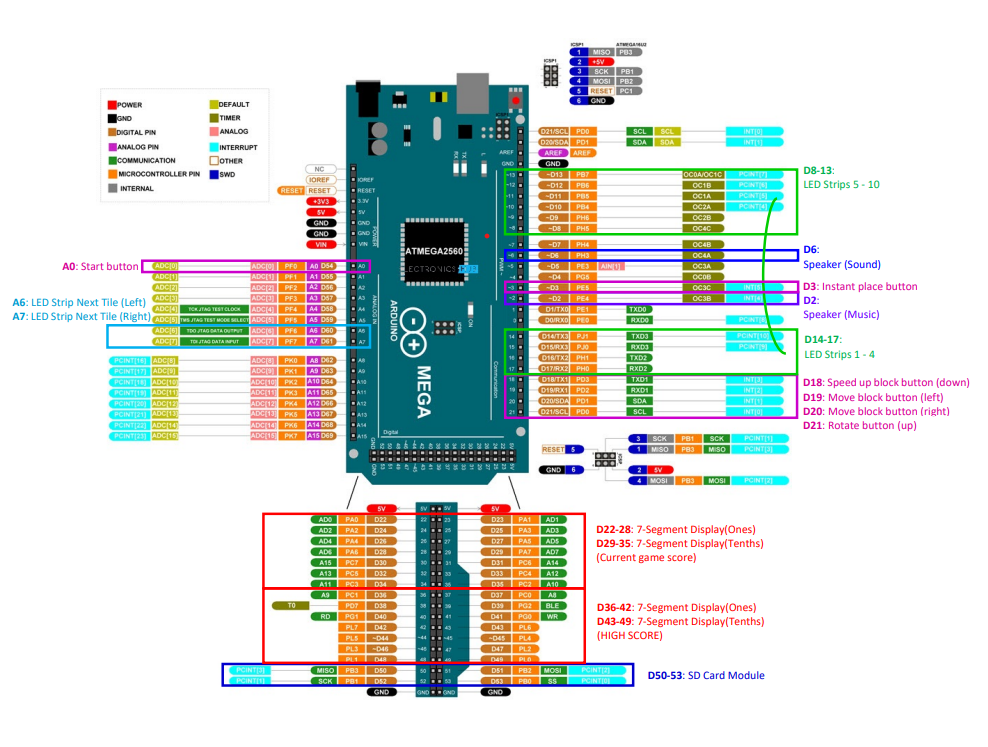

# Arduino Tetris Game

## Software Libraries Used

<b>Adafruit_NeoPixel</b> - Manipulate LED strips  
<b>SD</b> - Read/Write of SD cards  
<b>SPI</b> - Interface for SD card to connect  
<b>TMRpcm</b> - Play WAV audio files from SD card using AVR (UNO,Nano,etc) based devices  
<b>toneAC</b> - Replacement to the standard tone library with many advantages  

## Hardware Technologies Used

<b>Arduino Mega 2560 Rev3</b> - More processing power and PINS than an Arduino Uno 
<b>WS2812 Addressable LED Strip</b> - To display the main gameplay 
<b>LED Lighted Arcade Push Button (60mm)</b> - For Start and Hard Drop button 
<b>LED Lighted Arcade Push Button (45mm)</b> - For Rotate, Shift Left, Shift Right and Soft Drop button 
<b>Kingbright SA23-12SRWA 7-Segment Display</b> - To display the score and high score 
<b>MicroSD Card Adapter</b> - To read/write the files in an SD card 
<b>LCN-210 Desktop Wireless Speaker</b> - To blast the background music 
<b>8ohm 0.5W Mini Speaker (40mm)</b> - To play sound effects 
<b>PAM8403 Class-D Audio Amplifier Board</b> - Amplify the sound effects 

## Meet the team:

1. **Project Lead**
   - Shawn Koh Jun Jie
2. **Hardware team**
   - Tan Khai Ming
   - Teo Kai Xin, Hazel
3. **Software team**
   - Sean Young Song Jie
   - Ding Man
   - Han Zhize
   - Zhang Wei
4. **Design team**
   - Yap Qi Long, Marcel
   - Tan Zi Qi

## Arduino PINS Layout

Further Details can be found under the /Others and /reports
